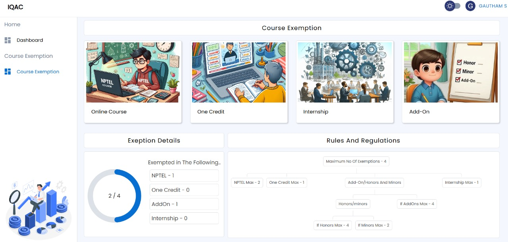

# 🎓Course Exemption Automation

Our goal is to overhaul the existing course exemption procedure by implementing a streamlined, user-centric system. This new platform not only simplifies the application process but also enhances tracking and approval workflows. By leveraging modern technologies, we ensure a reliable and scalable solution that meets the needs of students and administrators alike. 📈📋

## 🚀 Why This Project?
The problem of manually handling course exemptions was prevalent at our college, leading to delays, errors, and a heavy administrative burden. We took on the challenge of automating this process with a real-world solution that simplifies workflows, reduces paperwork, and ensures accurate handling of exemptions. Now, with this portal, students can request exemptions online, and administrators can manage them efficiently, all within a secure and robust system.

## 🛠 Tech Stack

This project is powered by a modern tech stack that ensures performance, security, and scalability:

- **Frontend**: React.js

- **Backend**: Node.js with Express.js

- **Database**: MySQL

- **Authentication**: Google Authentication (OAuth 2.0)

- **Security**: JWT Token-based Authentication & Middleware for API protection

## 🔒 Security Features

We’ve built this portal with high-level security measures, ensuring data integrity and secure access:

**Google OAuth Authentication**: Only authorized users within our organization can access the portal.

**JWT Token Verification**: Secure session management and user verification.

**Middleware API Authentication**: Every API request is authenticated through middleware, preventing unauthorized access.

**Protected Routes**: Users are restricted to their eligible routes based on their role, ensuring secure access to specific resources.
## 💡Key Features
- Automated Course Exemption Request Handling: Students can submit course exemption requests through an intuitive interface.

- Session Management: Timed sessions ensure that users remain securely logged in without compromising their information.
## 🏆 What Makes This Special?

**Real-World Application**: We solved an actual problem faced by our college with this automation, providing a tangible, impactful solution.

**Scalable & Efficient**: Our solution is designed for scalability and efficiency, making it adaptable for use in other institutions.

**Security at Its Core**: From authentication to API protection, we’ve implemented security measures that ensure user data is handled with the utmost care.

**Dashboard View**

